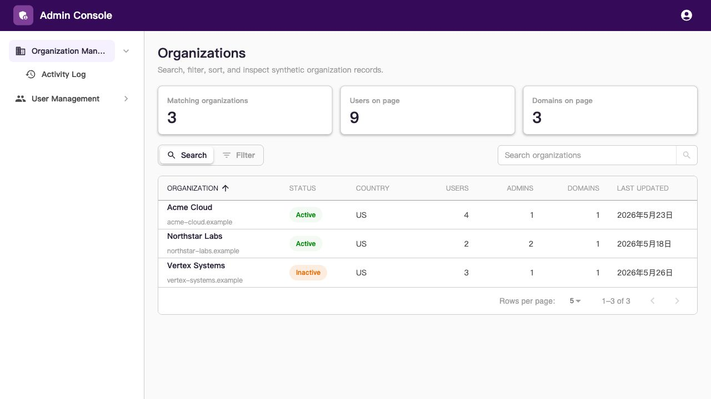
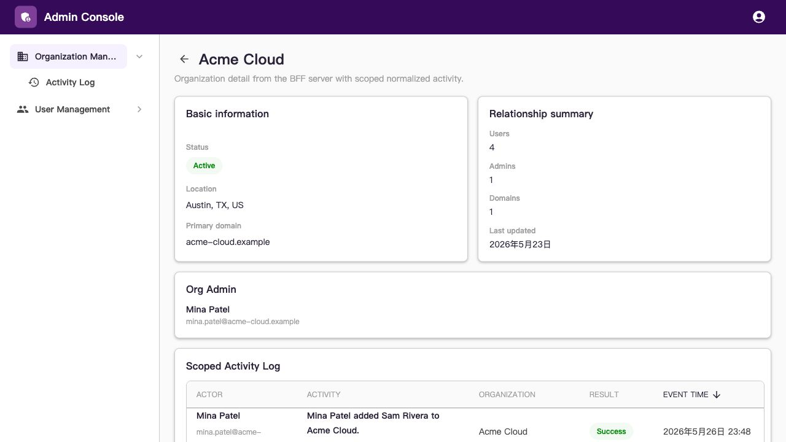
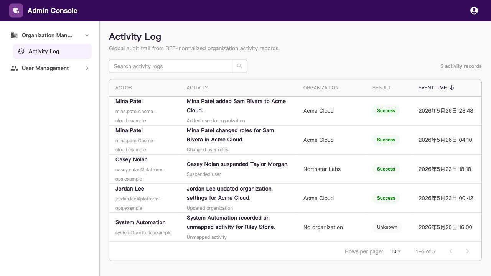
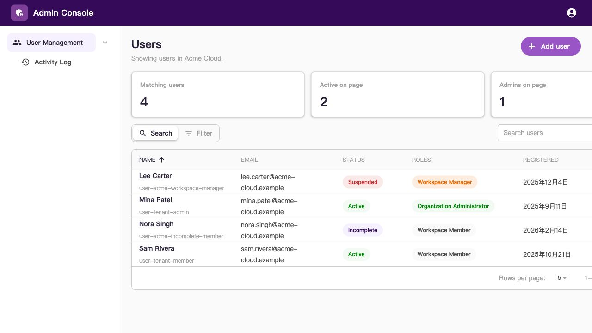
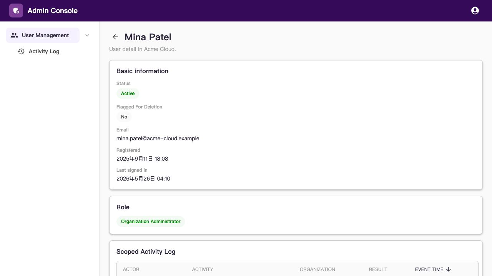
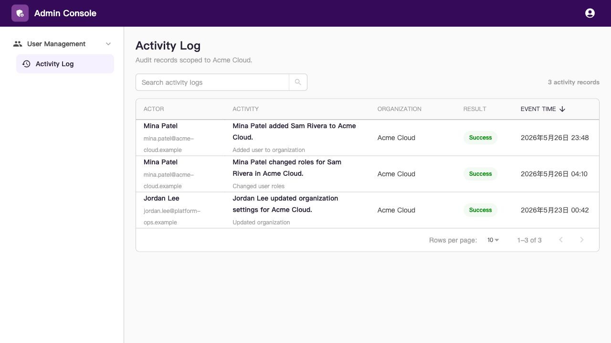

# Hugo SaaS Console

> Languages: English | [简体中文](README.zh-CN.md)

A B2B SaaS admin dashboard frontend portfolio built with React, TypeScript, Module Federation, and GraphQL.

This project demonstrates a modern micro-frontend architecture for tenant operations, organization/user management, and audit logging. It uses synthetic demo data only — no real customer information, production endpoints, or private business logic.

## What's inside

- **Module Federation architecture** — A host shell (`admin-console`) loads independently deployed feature remotes for Organization and User Management
- **B2B admin workflows** — Dense data tables, detail pages, and activity log views backed by a GraphQL BFF
- **External design system** — UI components consumed via `@hugo-ui/mui` npm package
- **pnpm workspaces monorepo** — Clean package boundaries between shell, shared utilities, and feature modules

## Screenshots

Captured from the local dev environment with synthetic demo data.

### Organization Management

| List                                                       | Detail                                                                    | Activity Log                                                               |
| ---------------------------------------------------------- | ------------------------------------------------------------------------- | -------------------------------------------------------------------------- |
|  |  |  |

### User Management

| List                                                           | Detail                                                             | Activity Log                                                                   |
| -------------------------------------------------------------- | ------------------------------------------------------------------ | ------------------------------------------------------------------------------ |
|  |  |  |

## Repository structure

```
packages/
├── admin-console/      # Host shell + Module Federation entry point
├── admin-shared/       # Shared session, auth, and UI utilities
├── org-management/     # Organization Management remote (list, detail, activity)
└── user-management/    # User Management remote (list, detail, activity)
```

This repository depends on two external companion projects:

| Dependency | Repository | Purpose |
|------------|------------|---------|
| Admin BFF | [HugoHZXu/hugo-saas-backend](https://github.com/HugoHZXu/hugo-saas-backend) | GraphQL API, database schema, seed data, activity log normalization |
| Design System | [HugoHZXu/hugo-ui](https://github.com/HugoHZXu/hugo-ui) | Reusable UI components (`@hugo-ui/mui`), Storybook, tokens |

## Getting started

### Prerequisites

- Node.js `>=26.4.0`
- pnpm `>=11.7.0 <12`

### 1. Install dependencies

```bash
pnpm install
```

### 2. Start the backend

The dashboard requires a running Admin BFF. Clone and start the backend in a separate terminal:

```bash
git clone https://github.com/HugoHZXu/hugo-saas-backend.git ../hugo-saas-backend
cd ../hugo-saas-backend
pnpm install
pnpm run db:reset
pnpm run dev:admin-bff
```

### 3. Start the dashboard

Back in this repository:

```bash
pnpm run dev
```

This starts all three apps simultaneously:

| Service | URL |
|---------|-----|
| Admin Shell (host) | http://127.0.0.1:5173 |
| Organization Management (remote) | http://127.0.0.1:5174 |
| User Management (remote) | http://127.0.0.1:5175 |
| Admin BFF GraphQL | http://127.0.0.1:4010/graphql |

To run a single app in isolation, use `pnpm run dev:org-management`, `pnpm run dev:user-management`, or `pnpm run dev:admin-console`.

Open http://127.0.0.1:5173 to view the dashboard.

## Documentation

| Topic | English | 简体中文 |
|-------|---------|----------|
| Project overview & scope | [`docs/project-brief.md`](docs/project-brief.md) | [`docs/project-brief.zh-CN.md`](docs/project-brief.zh-CN.md) |
| Module Federation deployment | [`docs/module-federation-deployment.md`](docs/module-federation-deployment.md) | [`docs/module-federation-deployment.zh-CN.md`](docs/module-federation-deployment.zh-CN.md) |

## Design system integration

UI components are imported from the external `@hugo-ui/mui` npm package:

```tsx
import { HugoUIProvider, Table } from '@hugo-ui/mui';
```

## Validation

Run the full verification suite:

```bash
pnpm run verify
```

Individual checks:

```bash
pnpm run typecheck
pnpm run test:frontend
pnpm run build:all
```
